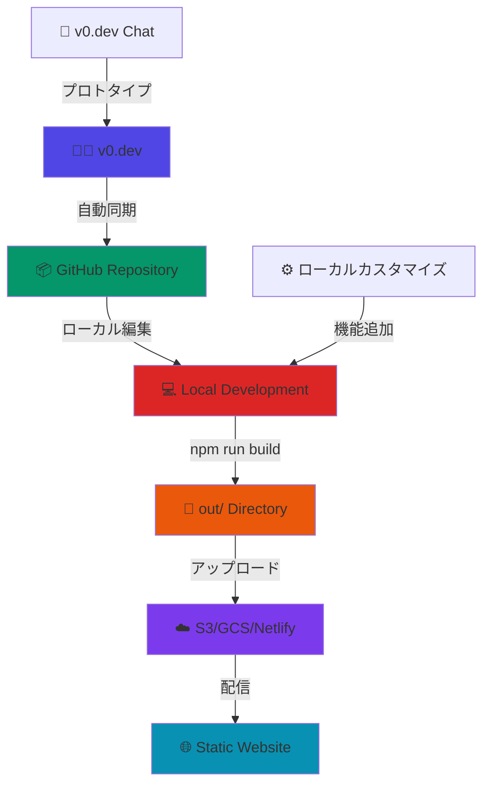

# 売上管理システム

*[v0.dev](https://v0.dev) デプロイメントと自動同期*

[](https://vercel.com/onodela2000s-projects/v0-next-js)
[](https://v0.dev/chat/projects/DhCOTzxVJ6G)

## 概要

このリポジトリは[v0.dev](https://v0.dev)でデプロイされたチャットと同期を保ちます。
デプロイされたアプリに加えた変更は、[v0.dev](https://v0.dev)からこのリポジトリに自動的にプッシュされます。

## プロジェクト機能

- 📊 売上データの可視化ダッシュボード
- 📈 リアルタイムチャートと分析
- 💼 顧客情報と売上履歴の管理
- 📱 レスポンシブデザイン対応
- 🎨 モダンなUIコンポーネント（shadcn/ui）

## 技術スタック

- **フレームワーク**: Next.js 15 (App Router)
- **言語**: TypeScript
- **スタイリング**: Tailwind CSS
- **UIライブラリ**: Radix UI + shadcn/ui
- **チャート**: Recharts
- **アイコン**: Lucide React
- **フォーム**: React Hook Form + Zod

## デプロイメント

プロジェクトのライブ版:

**[https://vercel.com/onodela2000s-projects/v0-next-js](https://vercel.com/onodela2000s-projects/v0-next-js)**

## アプリの開発を続ける

以下でアプリの開発を続けることができます:

**[https://v0.dev/chat/projects/DhCOTzxVJ6G](https://v0.dev/chat/projects/DhCOTzxVJ6G)**

## アーキテクチャ



### 開発・配信フロー

#### 1️⃣ プロトタイプ作成（v0.dev）
- [v0.dev](https://v0.dev)でチャット形式でUI作成
- 自動的にGitHubリポジトリに同期

#### 2️⃣ ローカル開発・カスタマイズ
- GitHubからクローンしてローカル編集
- 顧客管理、設定画面などの機能追加
- TypeScript、shadcn/uiでリッチな機能実装

#### 3️⃣ Static Export ビルド
```bash
npm run build  # out/ディレクトリに静的ファイル生成
```

#### 4️⃣ 静的ホスティング配信
- **Amazon S3** + CloudFront
- **Google Cloud Storage** + CDN
- **Netlify** / **Vercel** (Static Sites)
- **GitHub Pages**
- 任意のWebサーバー

### 技術的特徴

- 🚀 **Pre-rendered SPA**: SEO対応 + SPA動作
- 📦 **Static Export**: サーバー不要、CDN配信最適化
- 💾 **Client-side Storage**: ローカルストレージでデータ永続化
- 🔄 **Hot Reload**: v0.dev ↔ ローカル開発の柔軟な切り替え

## ローカル開発

```bash
# 依存関係のインストール
npm install

# 開発サーバーの起動
npm run dev

# 本番ビルド
npm run build

# 本番サーバーの起動
npm run start
```

プロジェクトは [http://localhost:3000](http://localhost:3000) で確認できます。